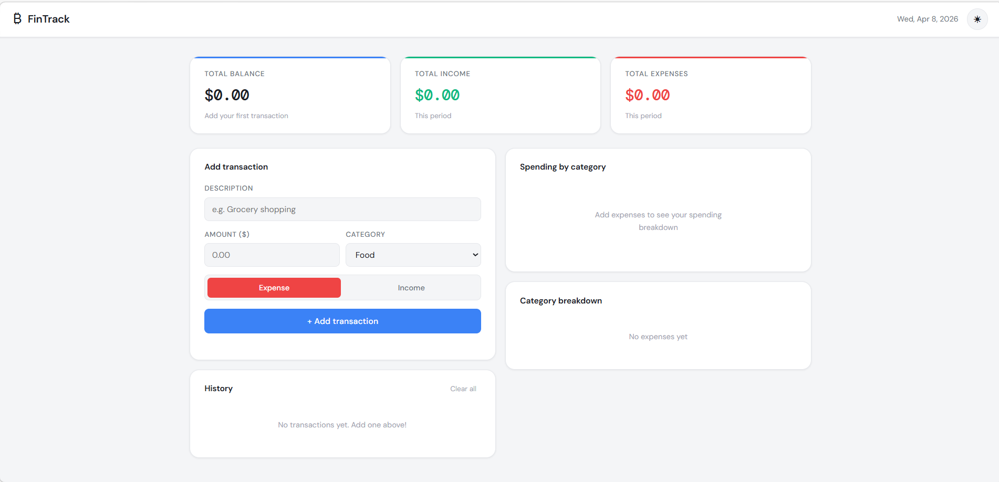
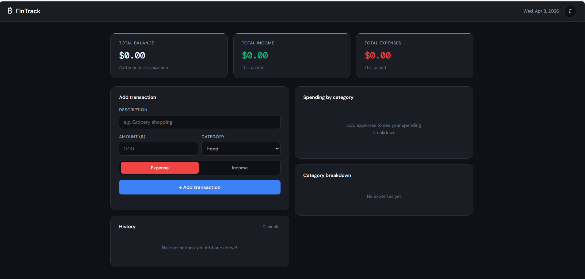

# Personal Finance Dashboard

A responsive, browser-based personal finance tracker built with vanilla HTML, CSS, and JavaScript. No frameworks, no backend, no installation required.

---

## Live Demo

https://anikethkommu.github.io/finance-dashboard/
---

## Features

 **Add & delete transactions** — track income and expenses instantly
 **Live summary cards** — balance, total income, and total expenses update in real time
 **Spending chart** — doughnut chart (Chart.js) showing expenses broken down by category
 **Category breakdown** — visual progress bars showing % of spending per category
 **localStorage persistence** — data survives page refresh, no database needed
 **Dark / light mode toggle** — preference saved across sessions
 **Fully responsive** — works on mobile, tablet, and desktop
 **Zero dependencies** — only Chart.js loaded via CDN

---

## Project Structure

```
finance-dashboard/
├── index.html      # App structure and layout
├── style.css       # Styling, dark mode, responsive design
├── app.js          # All logic — transactions, chart, storage
└── README.md       
```

---

## Built With

| Technology | Purpose |
|---|---|
| HTML5 | Semantic page structure |
| CSS3 | Flexbox, Grid, CSS variables, animations |
| JavaScript | DOM manipulation, localStorage, logic |
| Chart.js | Doughnut chart visualization |
| Google Fonts | DM Sans + DM Mono typography |

---

## How to Run Locally

1. Clone the repository:
   ```bash
   git clone https://github.com/anikethkommu/finance-dashboard.git
   ```
2. Open the folder in VS Code
3. Right-click `index.html` → **Open with Live Server**
4. The app opens in your browser at `http://127.0.0.1:5500`


---

## Screenshots





---

## Key Concepts Demonstrated

- **CSS custom properties** for consistent theming and one-line dark mode
- **Event delegation** for efficient dynamic list interactions
- **localStorage API** for client-side data persistence
- **Chart.js integration** for real-time data visualization
- **Responsive layout** using CSS Grid and media queries
- **Form validation** with user-friendly error messages
- **XSS prevention** via safe HTML escaping

---

## Possible Future Improvements

- Filter transactions by date range or category
- Export data to CSV
- Monthly budget goals with progress tracking
- Multi-currency support

---

## License

This project is open source and available under the [MIT License](LICENSE).

---

## Author

**Your Name**
- GitHub: [@anikethkommu](https://github.com/anikethkommu)
